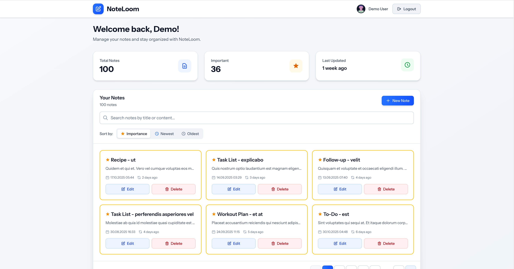

# NoteLoom

> A modern, full-stack note management application built with Laravel 12 and Livewire 3.6

> This application has been developed with Claude Code (Sonnet 4.5)

> Future security improvements are contained in SECURITY_REPORT.md file

**NoteLoom** is a professional demonstration application showcasing advanced proficiency in Laravel and modern frontend frameworks. Built as a technical showcase, it implements a complete note management system with real-time reactive components, intelligent database-driven search and pagination, and a polished, responsive user interface.



## 🎯 Project Context

This application was developed as a solution to a technical assessment challenge with the following constraints:
- **Tech stack:** Laravel 12 + Livewire 3.6 (no additional packages allowed)
- **Goal:** Demonstrate best practices in modern full-stack development
- **Focus areas:** Code quality, Laravel conventions, reactive UI patterns, and clean architecture

**Repository:** `https://github.com/jlmue/noteloom`

---

## Table of Contents

- [Features](#features)
- [Requirements Met](#requirements-met)
- [Prerequisites](#prerequisites)
- [Quick Start](#quick-start)
- [Manual Installation](#manual-installation)
- [Demo Account](#demo-account)
- [Running the Application](#running-the-application)
- [Usage Guide](#usage-guide)
- [Application Architecture](#application-architecture)
- [Database Schema](#database-schema)
- [Development](#development)
- [Testing](#testing)
- [Troubleshooting](#troubleshooting)
- [Tech Stack](#tech-stack)

---

## Features

### Core Functionality ✅

- **Complete CRUD Operations**
  - Create new notes with title, content, and importance flag
  - Read and display all notes with pagination
  - Update existing notes (inline editing)
  - Delete notes with confirmation

- **Smart Search**
  - Real-time search across note titles and content
  - Database-driven search with optimized queries
  - Search results update instantly as you type
  - Preserves pagination state during search

- **Advanced Filtering**
  - Filter by importance (show only important notes)
  - Combined search and filter capabilities
  - Instant filter application with Livewire reactivity

- **Importance Marking**
  - Visual distinction for important notes (gold star icons)
  - Quick toggle importance status
  - Filter view to show only important notes

- **Responsive Design**
  - Mobile-first approach with Tailwind CSS
  - Adaptive layouts for all screen sizes
  - Touch-friendly interfaces
  - Optimized for phones, tablets, and desktops

- **Real-time Pagination**
  - Efficient database pagination
  - Smooth page transitions
  - Maintains filter and search state across pages
  - Shows total results and current page info

### User Experience Features

- **Authentication System**
  - Secure user login
  - Password validation and encryption
  - Session management
  - Protected routes

- **Intuitive Dashboard**
  - Clean, modern interface
  - Easy-to-use note creation button
  - Grid layout for optimal note viewing
  - Visual feedback for all actions

- **Loading States**
  - Livewire loading indicators
  - Smooth transitions between states
  - Progress feedback for async operations

- **Data Persistence**
  - Automatic state management
  - No data loss during navigation
  - Reliable database handling

### Technical Features

- **Service Layer Architecture**
  - Separation of concerns with dedicated service classes
  - `NoteSearchService` for search logic
  - Reusable business logic
  - Clean, testable code

- **Optimized Database Queries**
  - Efficient search with indexed columns
  - Pagination to limit query results
  - Query optimization for performance

- **Event-Driven Communication**
  - Livewire event system for component communication
  - Reactive state management
  - Real-time UI updates

- **Code Quality**
  - PSR-12 compliant code style (Laravel Pint)
  - Comprehensive comments and documentation
  - Follows Laravel best practices and conventions
  - Clean, maintainable code structure

---

## Requirements Met

This application fulfills all core requirements and includes several bonus features:

### ✅ Core Requirements (All Implemented)

| Requirement | Status | Implementation                     |
|------------|--------|------------------------------------|
| Display all notes | ✅ Complete | Dashboard with paginated note list |
| Create new notes | ✅ Complete | Form with validation               |
| Edit existing notes | ✅ Complete | Inline editing with save/cancel    |
| Delete notes | ✅ Complete | Delete with confirmation dialog    |
| Responsive design | ✅ Complete | Mobile-first Tailwind CSS design   |
| Note: title field | ✅ Complete | String field with validation       |
| Note: content field | ✅ Complete | Text field with validation         |
| Note: created_at | ✅ Complete | Automatic timestamps               |
| Note: is_important | ✅ Complete | Boolean field with toggle          |

### ⭐ Bonus Features (Implemented)

| Bonus Feature | Status | Implementation Details |
|--------------|--------|----------------------|
| Search functionality | ✅ Complete | Real-time search in title and content |
| Filter functionality | ✅ Complete | Filter by importance status |
| Sorting | ✅ Complete | Sort by creation date (newest first) |
| Tests | ✅ Complete | Pest feature tests included |

### 🏆 Additional Enhancements

- **Service Layer Pattern**: Clean architecture with `NoteSearchService`
- **Demo Data Seeder**: Realistic example data with `NoteSeeder`
- **Comprehensive Documentation**: README.md and inline comments
- **Loading States**: User feedback during async operations
- **Error Handling**: Graceful error messages and validation feedback

---

## Prerequisites

Before installing NoteLoom, ensure your system meets these requirements:

- **PHP:** 8.2 or higher
- **Composer:** Latest version
- **Node.js:** v24.11.0
- **NPM:** v11.6.1
- **Database:** SQLite (default & recommended for quick setup) or MySQL/PostgreSQL

**Check your versions:**

```bash
php -v
composer -V
node -v
npm -v
```

---

## Quick Start

The fastest way to get NoteLoom up and running:

### 1. Clone the Repository

```bash
git clone https://github.com/jlmue/noteloom.git
cd noteloom
```

### 2. Automated Setup

Run the automated setup script:

```bash
composer setup
```

This command will:
- ✅ Install Composer dependencies
- ✅ Create `.env` file from `.env.example`
- ✅ Generate application key
- ✅ Run database migrations
- ✅ Install NPM dependencies
- ✅ Build frontend assets

### 3. Seed Demo Data (Optional)

To populate the application with 100 example notes and a demo user:

```bash
php artisan db:seed
```

### 4. Start Development Server

```bash
composer dev
```

This starts all development services concurrently:
- 🌐 PHP development server → http://localhost:8000
- 🔄 Queue worker
- 📋 Log viewer (Pail)
- ⚡ Vite dev server with Hot Module Replacement

### 5. Access the Application

Open your browser and navigate to:

```
http://localhost:8000
```

---

## Manual Installation

If you prefer step-by-step installation:

### Step 1: Install Dependencies

```bash
# Install PHP dependencies
composer install

# Install JavaScript dependencies
npm install
```

### Step 2: Environment Configuration

```bash
# Copy environment file
cp .env.example .env

# Generate application key
php artisan key:generate
```

### Step 3: Database Setup

**Using SQLite (Default):**

The database file is automatically created. Simply run migrations:

```bash
php artisan migrate
```

**Using MySQL/PostgreSQL:**

Update your `.env` file with database credentials:

```env
DB_CONNECTION=mysql
DB_HOST=127.0.0.1
DB_PORT=3306
DB_DATABASE=noteloom
DB_USERNAME=your_username
DB_PASSWORD=your_password
```

Then run migrations:

```bash
php artisan migrate
```

### Step 4: Seed Database (Optional)

```bash
php artisan db:seed
```

### Step 5: Build Assets

**Development build:**
```bash
npm run dev
```

**Production build:**
```bash
npm run build
```

### Step 6: Start Services

**Option A: All services (Recommended)**
```bash
composer dev
```

**Option B: Individual services**
```bash
# Terminal 1: PHP server
php artisan serve

# Terminal 2: Queue worker
php artisan queue:listen

# Terminal 3: Vite dev server
npm run dev

# Terminal 4: Log viewer
php artisan pail
```

---

## Demo Account

After running `php artisan db:seed`, you can log in with the demo account:

### Demo User Credentials

```
Email:    demo@noteloom.com
Password: yFvvYxs!RYPR1fY2gNu&%Wy#LwFpicik
```

**📝 Note:** If you didn't run the seeder, you can create a new account using the registration form.

### Included Demo Data

The seeder creates:
- ✅ 1 demo user account
- ✅ 100 realistic example notes with varied content
- ✅ Mix of important and regular notes
- ✅ Timestamps spanning the last 3 months

---

## Running the Application

### Development Mode

**All services (recommended):**
```bash
composer dev
```

Access at: http://localhost:8000

**Stop all services:** Press `Ctrl+C` in the terminal

### Individual Services

```bash
# Development server only
php artisan serve

# Vite dev server with HMR
npm run dev

# Queue worker
php artisan queue:listen

# Log viewer
php artisan pail
```

### Production Build

```bash
# Build optimized assets
npm run build

# Serve with optimized assets
php artisan serve
```

---

## Usage Guide

This section provides a comprehensive walkthrough of using NoteLoom after installation.

### First Time Setup

1. **Access the Application**
   - Open your browser to `http://localhost:8000`
   - You'll be redirected to the login page

2. **Option A: Use Demo Account**
   ```
   Email:    demo@noteloom.com
   Password: yFvvYxs!RYPR1fY2gNu&%Wy#LwFpicik
   ```
   _(Only available if you ran `php artisan db:seed`)_

3. **Option B: Create New Account**
   - Click "Register" or "Sign Up"
   - Enter your name, email, and password
   - Click "Register" to create your account
   - You'll be automatically logged in

### Dashboard Overview

After logging in, you'll see the main dashboard with:

- **Header**: Application name and user menu (logout)
- **Search Bar**: Real-time search across all your notes
- **Filters**: Toggle to show only important notes
- **Create Note Button**: Blue button to add new notes
- **Notes Grid**: Your notes displayed in a responsive grid
- **Pagination Controls**: Navigate through pages if you have many notes

### Creating a Note

1. **Open Create Form**
   - Click the "Create Note" button (blue button with plus icon)
   - Create Page appears

2. **Fill Note Details**
   - **Title**: Enter a descriptive title (required)
   - **Content**: Write your note content (required)
   - **Mark as Important**: Check the checkbox to flag as important

3. **Save the Note**
   - Click "Create Note" button to save
   - You are automatically navigated back to the dashboard
   - Your new note appears in the grid
   - Notes are sorted by creation date (newest first)

**Validation:**
- Title and content are required fields
- You'll see red error messages if fields are empty
- Form won't submit until validation passes

### Viewing Notes

**Grid Layout:**
- Notes are displayed in a responsive grid
- Each note card shows:
  - Title (bold, larger font)
  - Content preview (truncated if long)
  - Creation date (e.g. "04.11.2025")
  - Updated at (In human-readable format)
  - Importance icon (gold star if marked important)
  - Action buttons (Edit, Delete)

**Pagination:**
- 6 notes per page by default
- Use "Previous" and "Next" buttons to navigate
- Current page and total results shown
- Pagination maintains search and filter state

### Editing a Note

1. **Enter Edit Mode**
   - Click the "Edit" button (pencil icon) on any note card or the notes title
   - The note card expands to edit mode

2. **Modify Note Details**
   - Update the title in the text input
   - Update the content in the textarea
   - Toggle the "Important" checkbox to change importance

3. **Save or Cancel**
   - **Save**: Click the blue "Save" button to persist changes
   - **Cancel**: Click the gray "Cancel" button to discard changes
   - Changes are immediately reflected without page reload

**Note:** You can only edit one note at a time. Starting to edit another note will cancel the current edit.

### Deleting a Note

1. **Click Delete Button**
   - Click the "Delete" button (trash icon) on any note card
   - A browser confirmation dialog appears

2. **Confirm Deletion**
   - Click "OK" to permanently delete the note
   - Click "Cancel" to keep the note

3. **Note is Removed**
   - The note disappears from the grid immediately
   - No undo is available - deletion is permanent

**Tip:** Be careful with deletions, especially if you have important information!

### Searching Notes

**Real-Time Search:**
- Type in the search box at the top of the dashboard
- Search works across both title and content
- Results update instantly as you type
- Search is case-insensitive

**How It Works:**
- Searches for your query in note titles AND content
- Uses database-level search for performance
- Pagination resets to page 1 when searching
- Shows total matching results

**Examples:**
- Search "meeting" - finds all notes with "meeting" in title or content
- Search "2025" - finds notes mentioning that year
- Search partial words - "proj" finds "project", "projection", etc.

**Clear Search:**
- Delete text from search box to show all notes again
- Or click any clear/reset button if available

### Filtering Notes

**Filter by Importance:**
- Click the "Important Only" filter toggle/checkbox
- Only notes marked as important are displayed
- Filter works in combination with search
- Pagination adjusts to filtered results

**Combining Search and Filter:**
- You can use search and filter together
- Example: Search "meeting" + Filter "Important" = Important notes about meetings
- Both filters are preserved when navigating pages

**Clear Filter:**
- Uncheck the "Important Only" filter
- All notes (or search results) will be shown again

### Managing Importance

**Mark Note as Important:**
- Edit the note
- Check the "Mark as important" checkbox
- Save the note
- The note now displays a gold star icon

**Remove Importance:**
- Edit the note
- Uncheck the "Mark as important" checkbox
- Save the note
- The gold star icon is removed

**Visual Indicators:**
- Important notes have a gold/yellow star icon
- Icon appears near the note title
- Makes important notes easy to spot at a glance

### Mobile Usage

NoteLoom is fully responsive and works great on mobile devices with at least 320px (can be improved):

**Phone Layout:**
- Notes stack in a single column
- Touch-friendly buttons and forms
- Forms adapt to screen size
- Easy scrolling and navigation

**Tablet Layout:**
- Notes display in 2 columns
- Comfortable touch targets
- Optimal use of screen space

**Tips for Mobile:**
- Use the search bar to quickly find notes
- Swipe to scroll through long notes
- Tap edit/delete buttons carefully to avoid mistakes
- Portrait orientation works best for editing

### Keyboard Shortcuts

While NoteLoom doesn't have dedicated keyboard shortcuts, you can use standard browser shortcuts:

- **Tab**: Navigate between form fields
- **Enter**: Submit forms (when focused on input)
- **Escape**: Close modals (browser default)
- **Ctrl/Cmd + F**: Browser's find function (different from app search)

### Best Practices

**Organization:**
- Use descriptive titles for easy scanning
- Mark truly important notes only (avoid over-flagging)
- Use the search function to find old notes
- Review and delete outdated notes regularly

**Content:**
- Keep note content focused and concise
- Use line breaks for readability
- Include dates or deadlines in content if relevant
- Consider using keywords for better searchability

**Performance:**
- The app handles thousands of notes efficiently
- Search is optimized for speed
- Pagination keeps the interface responsive
- No lag even with large note collections

### Troubleshooting Usage Issues

**Issue: Can't create a note**
- Check that title and content are not empty
- Look for red validation error messages
- Ensure you're logged in
- Try refreshing the page

**Issue: Search not working**
- Check that you're typing in the search box (not browser find)
- Wait a moment for results to load
- Try clearing the search and searching again
- Refresh the page if search seems stuck

**Issue: Note won't save when editing**
- Ensure you clicked the blue "Save" button
- Check for validation errors
- Verify you're still logged in
- Try canceling and editing again

**Issue: Can't see my notes**
- Check if a filter is active (deactivate "Important Only")
- Clear the search box
- Verify you created notes while logged in as this user
- Try refreshing the page

---

## Application Architecture

NoteLoom follows Laravel best practices and modern architectural patterns for clean, maintainable code.

### MVC + Livewire Pattern

The application uses Laravel's MVC architecture enhanced with Livewire components:

```
User Request → Routes → Livewire Component → Service Layer → Model → Database
                             ↓
                        Blade View (with Livewire directives)
```

### Directory Structure

```
app/
├── Livewire/
│   ├── Dashboard.php           # Main dashboard component (note list)
│   ├── NoteForm.php            # Create/edit note
│   └── LoginForm.php           # Authentication
├── Models/
│   ├── Note.php                # Note Eloquent model
│   └── User.php                # User model (with authentication)
├── Services/
│   └── NoteSearchService.php   # Search & filter business logic
└── Providers/
    └── AppServiceProvider.php   # Service container bindings

resources/views/
├── livewire/
│   ├── dashboard.blade.php      # Dashboard view
│   ├── note-form.blade.php      # Note form
│   └── login-form.blade.php     # Login view
└── components/
    └── layout.blade.php         # Base layout

database/
├── migrations/
│   └── 2024_xx_xx_create_notes_table.php
├── factories/
│   └── NoteFactory.php          # Test data factory
└── seeders/
    └── NoteSeeder.php           # Demo data seeder
```

### Component Breakdown

#### 1. Dashboard Component (`app/Livewire/Dashboard.php`)

**Responsibilities:**
- Display paginated list of notes
- Handle search and filter state
- Manage note editing mode
- Delete notes with confirmation
- Emit events to child components

**Key Features:**
- Reactive properties: `$search`, `$importantOnly`, `$editingNoteId`
- Computed property: `#[Computed] notes()` for pagination
- Event listeners: Listens for `note-created` and `note-updated`
- Real-time reactivity with Livewire's `wire:model`

#### 2. NoteForm Component (`app/Livewire/NoteForm.php`)

**Responsibilities:**
- Create new notes via form
- Validate form input
- Emit success events to parent

**Key Features:**
- Form validation with Laravel's validation rules
- Livewire `#[Validate]` attributes
- Event dispatch on successful creation
- Automatic form reset after save

#### 3. NoteSearchService (`app/Services/NoteSearchService.php`)

**Responsibilities:**
- Centralized search and filter logic
- Build optimized database queries
- Separate business logic from presentation

**Key Features:**
- Accepts search term and importance filter
- Returns query builder for flexible pagination
- Efficient LIKE queries with OR conditions
- Adheres to Single Responsibility Principle

### Data Flow Examples

#### Creating a Note

1. User clicks "Create Note" button in `Dashboard`
2. Form in `NoteForm` component opens
3. User fills title, content, importance flag
4. Form validation runs on submit
5. `NoteForm` saves note to database via `Note` model
6. `NoteForm` emits `note-created` event
7. `Dashboard` listens to event and refreshes note list
8. UI updates automatically via Livewire reactivity

#### Searching Notes

1. User types in search box (bound with `wire:model.live`)
2. Livewire detects change and calls `updated()` hook in `Dashboard`
3. `Dashboard` resets pagination to page 1
4. `notes()` computed property re-executes
5. `NoteSearchService` builds filtered query
6. Database returns matching notes
7. Blade view re-renders with updated results
8. No page reload required

### Service Layer Pattern

The application implements a service layer to separate business logic from presentation:

**Benefits:**
- **Testability**: Services can be unit tested independently
- **Reusability**: Same logic can be used in multiple components
- **Maintainability**: Changes to search logic only affect one class
- **Single Responsibility**: Components focus on UI, services focus on logic

**Example: NoteSearchService**

```php
// app/Services/NoteSearchService.php
public function search(User $user, ?string $search = null, ?bool $importantOnly = null)
{
    $query = Note::where('user_id', $user->id);

    if ($search) {
        $query->where(function ($q) use ($search) {
            $q->where('title', 'like', "%{$search}%")
              ->orWhere('content', 'like', "%{$search}%");
        });
    }

    if ($importantOnly) {
        $query->where('is_important', true);
    }

    return $query->orderBy('created_at', 'desc');
}
```

### State Management

**Livewire Properties:**
- All component state is stored in public properties
- Properties are automatically synced between frontend and backend
- `wire:model.live` provides real-time two-way binding

**Session State:**
- User authentication uses Laravel's session-based auth
- Database-backed sessions for persistence

**Database State:**
- All notes are persisted to SQLite database
- Eloquent ORM handles all database interactions
- Migrations ensure consistent schema

### Event-Driven Communication

Components communicate via Livewire's event system:

**Dispatching Events:**
```php
$this->dispatch('note-created'); // From NoteForm
```

**Listening to Events:**
```php
#[On('note-created')]
public function refreshNotes() { /* ... */ }
```

**Benefits:**
- Loose coupling between components
- Components don't need direct references to each other
- Easy to add new listeners without modifying dispatchers

### Security Measures

- **Authentication**: All note routes protected by `auth` middleware
- **Authorization**: Users can only see/edit their own notes
- **CSRF Protection**: All forms include CSRF tokens automatically
- **SQL Injection Prevention**: Eloquent uses parameter binding
- **XSS Prevention**: Blade escapes output by default
- **Mass Assignment Protection**: Models use `$fillable` whitelist

---

## Database Schema

### Notes Table

The core `notes` table stores all user notes:

```sql
CREATE TABLE notes (
    id              INTEGER PRIMARY KEY AUTOINCREMENT,
    user_id         INTEGER NOT NULL,
    title           VARCHAR(255) NOT NULL,
    content         TEXT NOT NULL,
    is_important    BOOLEAN DEFAULT 0,
    created_at      TIMESTAMP,
    updated_at      TIMESTAMP,

    FOREIGN KEY (user_id) REFERENCES users(id)
);
```

**Column Details:**

| Column | Type | Nullable | Default | Description |
|--------|------|----------|---------|-------------|
| `id` | INTEGER | No | Auto | Primary key |
| `user_id` | INTEGER | No | - | Foreign key to users table |
| `title` | VARCHAR(255) | No | - | Note title/heading |
| `content` | TEXT | No | - | Full note content |
| `is_important` | BOOLEAN | Yes | false | Importance flag |
| `created_at` | TIMESTAMP | Yes | NULL | Creation timestamp |
| `updated_at` | TIMESTAMP | Yes | NULL | Last update timestamp |

**Indexes:**
- Primary key on `id` (automatic)

**Relationships:**
- `user_id` → `users.id` (Many-to-One)
- Cascade delete: Deleting a user deletes all their notes

### Users Table

Standard Laravel authentication table:

```sql
CREATE TABLE users (
    id                 INTEGER PRIMARY KEY AUTOINCREMENT,
    name               VARCHAR(255) NOT NULL,
    email              VARCHAR(255) NOT NULL UNIQUE,
    email_verified_at  TIMESTAMP NULL,
    password           VARCHAR(255) NOT NULL,
    remember_token     VARCHAR(100) NULL,
    created_at         TIMESTAMP,
    updated_at         TIMESTAMP
);
```

### Additional Tables

**Cache Table** (`cache`)
- Stores database cache entries
- Used for application-level caching

**Sessions Table** (`sessions`)
- Stores user session data
- Enables database-backed sessions

**Jobs Table** (`jobs`)
- Stores queued jobs
- Used for background processing (if needed)

### Entity Relationship Diagram

```
┌─────────────────┐
│     users       │
├─────────────────┤
│ id (PK)         │
│ name            │
│ email           │
│ password        │
│ created_at      │
│ updated_at      │
└────────┬────────┘
         │
         │ 1:N
         │
         ▼
┌─────────────────┐
│     notes       │
├─────────────────┤
│ id (PK)         │
│ user_id (FK)    │◄──── Foreign Key
│ title           │
│ content         │
│ is_important    │
│ created_at      │
│ updated_at      │
└─────────────────┘
```

### Note Model (`app/Models/Note.php`)

```php
<?php

namespace App\Models;

use Illuminate\Database\Eloquent\Model;
use Illuminate\Database\Eloquent\Relations\BelongsTo;

class Note extends Model
{
    protected $fillable = [
        'title',
        'content',
        'is_important',
    ];

    protected $casts = [
        'is_important' => 'boolean',
    ];

    public function user(): BelongsTo
    {
        return $this->belongsTo(User::class);
    }
}
```

**Key Features:**
- **Mass Assignment Protection**: `$fillable` array whitelists allowed fields
- **Type Casting**: `is_important` automatically cast to boolean
- **Relationship**: `user()` method defines belongsTo relationship
- **Timestamps**: Automatically managed by Laravel

### Database Queries

**Common Queries Used:**

```php
// Get all user's notes with pagination
Note::where('user_id', $userId)
    ->orderBy('created_at', 'desc')
    ->paginate(10);

// Search notes
Note::where('user_id', $userId)
    ->where(function($q) use ($search) {
        $q->where('title', 'like', "%{$search}%")
          ->orWhere('content', 'like', "%{$search}%");
    })
    ->orderBy('created_at', 'desc')
    ->paginate(10);

// Filter important notes
Note::where('user_id', $userId)
    ->where('is_important', true)
    ->orderBy('created_at', 'desc')
    ->paginate(10);
```

---

## Development

### Code Quality

**Format code with Laravel Pint:**

```bash
# Fix code style
vendor/bin/pint

# Check without fixing
vendor/bin/pint --test
```

### Database Management

```bash
# Fresh migration (drops all tables)
php artisan migrate:fresh

# Fresh migration with seeding
php artisan migrate:fresh --seed

# Rollback last migration
php artisan migrate:rollback

# Run specific seeder
php artisan db:seed --class=NoteSeeder
```

### Cache Management

```bash
# Clear all caches
php artisan optimize:clear

# Clear specific caches
php artisan config:clear
php artisan route:clear
php artisan view:clear
```

### Livewire Development

```bash
# Create new Livewire component
php artisan make:livewire ComponentName

# View list of Livewire components
php artisan livewire:list
```

---

## Testing

NoteLoom uses Pest for testing.

### Run All Tests

```bash
# Using composer script
composer test

# Or directly
php artisan test
```

### Run Specific Tests

```bash
# Run specific file
php artisan test tests/Feature/ExampleTest.php

# Run specific test
php artisan test --filter=test_example

# With parallel execution
php artisan test --parallel
```

### Test Configuration

Tests use an in-memory SQLite database for speed. Configuration is in `tests/Pest.php`.

---

## Troubleshooting

### Common Issues

#### 1. "Permission denied" errors

**Solution:**
```bash
# Fix storage and cache permissions
chmod -R 775 storage bootstrap/cache
```

#### 2. "Class 'Redis' not found"

**Solution:** Redis is not required. Update `.env`:
```env
QUEUE_CONNECTION=database
CACHE_STORE=database
SESSION_DRIVER=database
```

#### 3. "npm ERR! code ENOENT"

**Solution:**
```bash
# Remove node_modules and reinstall
rm -rf node_modules package-lock.json
npm install
```

#### 4. Database connection errors

**Solution for SQLite:**
```bash
# Ensure database file exists
touch database/database.sqlite
php artisan migrate
```

**Solution for MySQL:**
- Verify credentials in `.env`
- Ensure database exists
- Check MySQL service is running

#### 5. "Vite manifest not found"

**Solution:**
```bash
# Build assets
npm run build
```

#### 6. Port 8000 already in use

**Solution:**
```bash
# Use different port
php artisan serve --port=8080
```

### Getting Help

If you encounter issues:

1. **Check Laravel logs:** `storage/logs/laravel.log`
2. **Enable debug mode:** Set `APP_DEBUG=true` in `.env`
3. **Clear caches:** Run `php artisan optimize:clear`
4. **Verify environment:** Run `php artisan about`

---

## Tech Stack

### Backend

- **Laravel 12** - PHP framework
- **Livewire 3.6** - Full-stack reactive framework
- **PHP 8.2+** - Programming language
- **SQLite** - Default database (MySQL/PostgreSQL supported)
- **Pest** - Testing framework

### Frontend

- **Tailwind CSS 4.0** - Utility-first CSS framework
- **Vite** - Frontend build tool
- **Alpine.js** - Included with Livewire for JavaScript interactions

### Development Tools

- **Laravel Pint** - Code formatter
- **Laravel Pail** - Log viewer
- **Concurrently** - Run multiple dev servers
- **Hot Module Replacement** - Instant frontend updates during development

---

## Project Structure

```
.
├── app/
│   ├── Livewire/          # Livewire components
│   ├── Models/            # Eloquent models
│   └── ...
├── database/
│   ├── factories/         # Model factories
│   ├── migrations/        # Database migrations
│   └── seeders/           # Database seeders
├── resources/
│   ├── css/               # Stylesheets
│   ├── js/                # JavaScript
│   └── views/             # Blade templates
├── routes/
│   └── web.php            # Web routes
├── tests/                 # Pest tests
└── ...
```

---

## Environment Variables

Key environment variables in `.env`:

```env
APP_NAME=NoteLoom
APP_ENV=local
APP_DEBUG=true
APP_URL=http://localhost:8000

DB_CONNECTION=sqlite
# DB_CONNECTION=mysql  # Alternative

QUEUE_CONNECTION=database
CACHE_STORE=database
SESSION_DRIVER=database
```

---

## License

This project is open-sourced software licensed under the [MIT license](https://opensource.org/licenses/MIT).

---

**Built with ❤️ using Laravel and Livewire**
